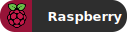

## Victor Brugnago

---------------------------------------------------------------------------------------------------------------------------------------------------------------------------------
Hi, I'm Victor Brugnago, a Computer Engineering Student from Brazil, currently, I'm a Scientific Researcher at Instituto Federal de Mato Grosso 🙍🏽‍♂️. Beside's programming, I enjoy eating food and playing a MMORPG, Real-time Strategy and Turn-based Strategy games.

**Talking about Personal Stuffs:**

- 👨🏽‍💻 I’m currently studying on Instituto Federal de Mato Grosso (IFMT);
- 🌱 I’m currently learning C++, MongoDB and Django; 
- 💬 Ask me about anything, I am happy to help;
- ⚡️ Fun-Fact: I started programming when I created my own plugins for my Minecraft Server, in 2011;
- 📝[Resume](http://lattes.cnpq.br/2439519957293998)

---------------------------------------------------------------------------------------------------------------------------------------------------------------------------------
**Languages and Tools:**  

    
    
    
    
    
    
    
    
    
    
    
    
    

